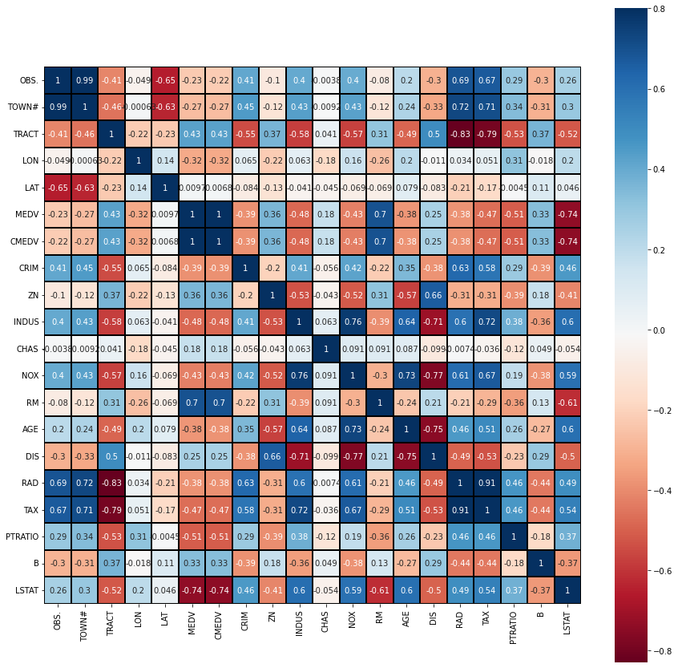

# Predicting Housing Value Within the Suburbs of Boston, Massachusetts

## Data Source
Data collected in 1978 for homes from various suburbs in Boston, Massachusetts. There are 507 entries that include 20 features. 
<!-- Augmented Dataset is from -->

## Questions the team hopes to answer with data
What would be the median value for a home in 2022? 

## Reasoning behind selection
Our first choice of dataset, NOAA Storm Events Dataset, upon further research, was poorly fit for a machine learning model. Using a Time-Series analysis, such as Autoregressive Integrated Moving Average, was ultimately not going to work well since the dataset does not have consistent, time-stamped data. 

With one week of work down, we decided to pivot to a dataset that has been successfully used in the past. The Boston Housing Data was our choice because it had a clear set of features and would allow us to move onto the technical phases of the project. 

# Data Exploration Phase
<!-- NOAA Dataset and Time-Series Analysis notes to be added by Chris -->

Applied the Pearson Standard Correlation Coefficient method and mapped the results onto a heatmap. The heatmap provides a visual method to see the connections between the features. 

 

- Features MEDV, RM, INDUS, NOX, TAX, AGE, RAD, LSTAT, DIS, TRACT, CRIM are significant. The non-significant features have been dropped from the dataframe. 
- Feature MEDV has been multiplicative scaled to account for market inflation (x1000)

<!-- What does R2 and RMSE score mean to us -->
<!-- Add information on work done in R -->

#### Technologies, languages, tools, and algorithms used in Data Exploration Phase
- Python
- Juypter Notebooks
- R
- Pearson Standard Correlation Coefficient
- Spearman Rank Correlation

# Analysis Phase

Based on the results of the Data Exploration Phase, we decided to use a Linear Regression machine learning model to test and train the data set. 

## Description of preliminary data preprocessing

## Description of preliminary feature engineering and preliminary feature selection, including the decision-making process
based on r score value from Linear Regression
graphs 

## Description of how data was split into training and testing sets

- In order to predict the outcome we are looking fore we need tp make sure we have a statistical understanding of the data. Using linear regression, we create training and test sets. we are trying to find a pattern that best represents all the data points with minimum error. Our random_states is defined so that the splits we create are reproducible. (It is a seed value) Therefore, we train the model using the training set and then apply the model to the test set (to test the accuracy of our training model). In this way, we can evaluate the performance of our model. It estimates how one variable affects the other & allows us to predict a continuous outcome.
- Rmse is the mean scared error the smaller the better.

## Explanation of model choice, including limitations and benefits

Our group chose Linear regression as a basic model to examine if our data can be used as predicative indicator. We specifically focus on which variables have significant contributors to the predicative outcome, and their magnitude. (By cleaning the data and filtering out the features one by one) Using this specific regression we want to determine the strength of predictors, and use it for trend forecasting.

## Description of how the model was trained (or retrained, if the team is using an existing model)

## Description of confusion matrix, including final accuracy score

#### Technologies, languages, tools, and algorithms used in Analysis Phase
- Python
- Juypter Notebooks
- R
- Linear Regression
- Scikit learn machine learning library in Python for predictive data analysis.

# Database Component
This project will utilize a Postgres type relational database  to be administered through the pdAdmin platform. It may be set up as an open source AWS database for accessability reasons. The database will hold multiple source and result tabular datasets for the different project components. 

<!-- Holds static data, interfaces with project (i.e. updates), 2+ tables, 1 join, 1 connection string -->

# Dashboard/Presentation Component

- Link to the final Dashboard (tableau public) <!-- Need to add -->

- Link to presentation 
https://www.canva.com/design/DAE_He3hj_o/uoBonR1moy5sQQpYUDiBQg/view?utm_content=DAE_He3hj_o&utm_campaign=designshare&utm_medium=link&utm_source=publishsharelink

- Crime Dashboard <!-- Need to add -->
https://public.tableau.com/shared/6NX7948XF?:display_count=n&:origin=viz_share_link

#### One question: If you had more time, where would you like to investigate for finer tuning? Keep this in mind as the presentation is being put together since it could be a really strong talking point.

# Team Communication Protocols
- Scheduled class time used as main collaborative work sessions
- Slack group chat used as an update channel for our individual work
- If needed, additional zoom meetings may be used

## Authors
> Becca Mae Hinkle | Chris Newell | Nalicia Tilman | Will Wilson

> April 2022

